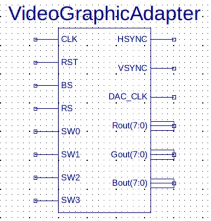
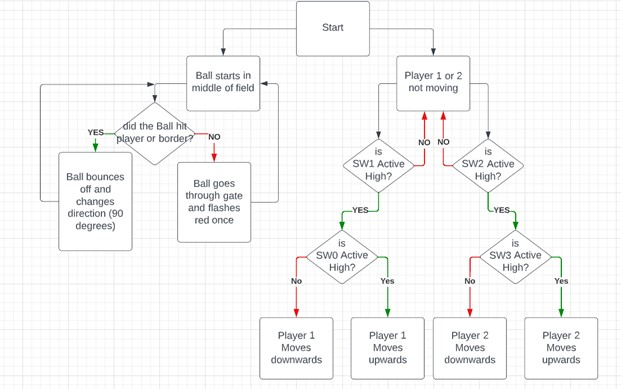
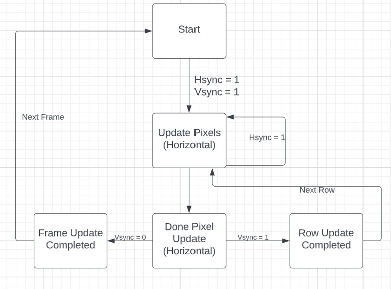
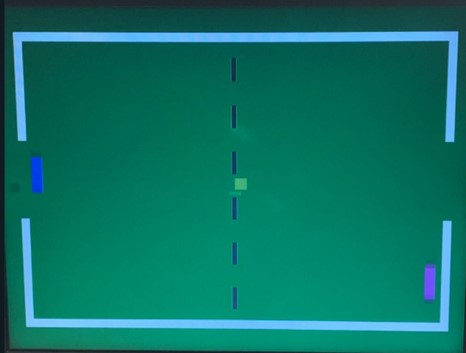
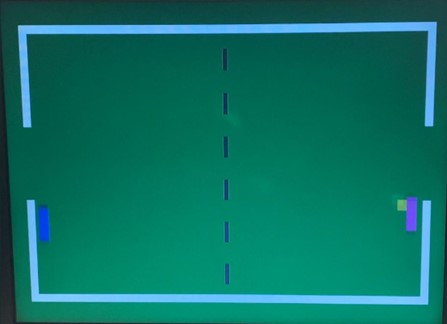
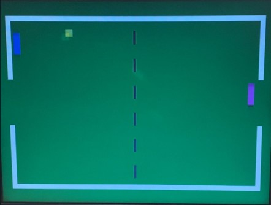
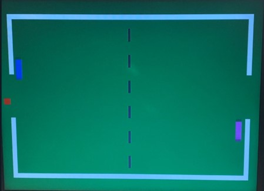

# Simple Video-Game Processor for VGA
## Abstract
This project focused on developing a Simple Video-Game Processor for a Video Graphics Array (VGA) on a Xilinx Spartan-3E FPGA. Objectives included understanding the VGA system's functionality, integrating pong game logic, and applying knowledge of synchronization and RGB output signals. The project outcomes were verified through successful VHDL coding and VGA design implementation, which were consistent with expected timing diagrams and RGB output.

## Introduction 
The objective was to engineer a pong game controlled through hardware switches, necessitating a comprehensive understanding of video output generation, synchronization signals, and real-time game mechanics. This project aimed to facilitate interface interactions via hardware and VHDL programming. The pong game display utilized pixel-specific synchronization signals for object motion representation, updating pixel values and colors based on game dynamics. The implementation involved coding in VHDL to manage game elements such as ball and paddle movements and collision detection. Key gameplay mechanics included ball movement at 60 pixels per second and paddle movement controlled via switches, which were vertically adjusted based on player input. The system's design facilitated the reset and synchronization of game elements through a counter setup based on predefined clock cycles, as detailed in the lab manual.

## Specifications
The general desired specifications were as follows:
1.	Static Video-frame:
For the static portion of the design, it requires that the game field would be green that include white borders.

2.	Dynamic Elements:
For the dynamic portion of the design, it requires a few elements for the ball and the players.
     - Yellow ball that flies on the field between the white borders specified and that reflects off those said borders as well as the players.
     - Players in Blue and Pink that can move up and down which are being controlled by switches on the board accordingly.

3.	Behavior:
For the behaviors of the elements integrated in the game, it requires that:
    - When the ball hits a player or border, it must change trajectory as of plus or minus ninety angular degrees based on the direction of the hit
    - When the ball passes the gate on the right or left, it will change color to red and dissapear while pass the video-frame. Then it should reappear as yellow once again in the center of the field.

### VGA Specifications:
Table I. VGA Horizontal Parameters
| Paramter          | Clock Cycles |
|-------------------|:------------:|
| Complete Line     | 800          |
| Front Porch       | 16           |
| Sync Pulse        | 96           |
| Back Porch        | 48           |
| Active Image Area | 640          |

Table II. VGA Vertical Parameters
| Paramter          | Clock Cycles |
|-------------------|:------------:|
| Complete Line     | 525          |
| Front Porch       | 10           |
| Sync Pulse        | 2            |
| Back Porch        | 33           |
| Active Image Area | 480          |

All horizontal time periods are specified in multiples of the VGA pixel clock, set at 25 MHz for a 60 Hz refresh rate. Vertical time periods are measured in multiples of VGA lines.

## Design

Figure 1. Block Symbol for Video Graphics Array Adapter 

The entire video game operates on a single .vhd file, as most of the symbol's inputs and outputs are directly interfaced with the FPGA board and monitor. Consequently, only one symbol is utilized, eliminating the need for a block diagram.

Figure 2. Pong Game Mechanism State Diagram

This diagram outlines the general mechanics of the Pong game. One pathway depicts ball movement, starting with a yellow ball at the center of the playfield. The ball moves, bounces off borders or players, and changes direction. If the ball passes through a gate, it flashes red, then resets to the center as a yellow ball again. Another pathway illustrates player movement, controlled by switches. Players remain stationary until switches SW1 (for player 1) or SW2 (for player 2) are activated. Switches SW0 and SW3 control vertical movement, moving players upward if active high and downward if active low.

Figure 3. Frame Generation State Diagram

This diagram details the frame generation process for displaying the Pong game. It starts with the pixel at the top-left of the screen. The update begins once both Hsync and Vsync are high, progressing through horizontal pixel updates. If horizontal updates are incomplete (Hsync = 1), the state remains unchanged. Once horizontal updates conclude, the Vsync status determines the next step: if Vsync = 0, a new frame begins; if Vsync = 1, the process moves to the next row of pixels.

## Results
After successfully rendering the Pong game on the monitor, several screenshots were captured to demonstrate the game's functionality. However, static images cannot fully convey the movement of the ball or the true colors of the game elements. In these images, Player One (on the left side) is represented in blue, while Player Two (on the right) appears in pink. The ball is depicted in yellow.

Figure 4. Initial State of Pong Game

Fig. 4. showcases the initial state of the game and the ball's response after passing through one of the gates. From the center of the field, the ball "flies" towards potential interactions: either towards a border, a player, or back through a gate. These interactions are depicted in subsequent screenshots.

Figure 5. Player Contact with Ball

In a moment where the ball approaches Player Two, the ball then rebounds in the opposite direction a illustrated in Fig. 5. The movement of Player Two, not visible here, involved using the FPGA board switch to position the paddle to intercept the ball.

Figure 6. Ball Contact with Border

Fig. 6. shows the scenario where the ball approaches a border, highlighting its collision with the border and subsequent directional change. The ball's diagonal movement towards the border, where it rebounds at a 90-degree angle, exemplifies this interaction.

Figure 7. Ball Contact with Border

Lastly, the sequence where the ball enters a gate is shown in Fig. 7. Upon entry, the ball briefly turns red and then resets to the center of the field as yellow, mirroring the state shown in Fig. 1.

## Conclusions

The project entailed designing a simple Pong game using VHDL code and an FPGA board, incorporating a VGA driver to manage frame generation and game mechanics. Displayed on monitors, the game utilized the FPGA board to control paddle movements for each player. This project demonstrated the capability of programming pixel behavior on displays, a fundamental concept in contemporary digital applications. The implementation of VGA through the Xilinx FPGA provided a practical learning experience in using high-performance signal generators and developing custom logic for FPGA implementation. The project met all specifications, and proper VHDL coding practices were employed to achieve the desired outcomes.

## **References**
[1] [SVGP-VGA Reference Manual](https://www.ecb.torontomu.ca/~lkirisch/ele758/labs/SimpleVideoGame[11-11-11].pdf)
